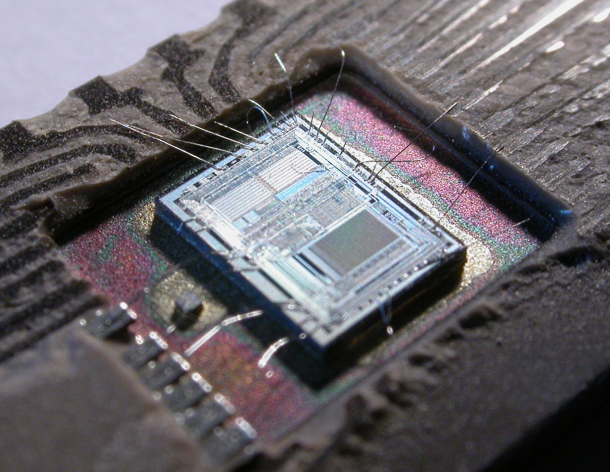
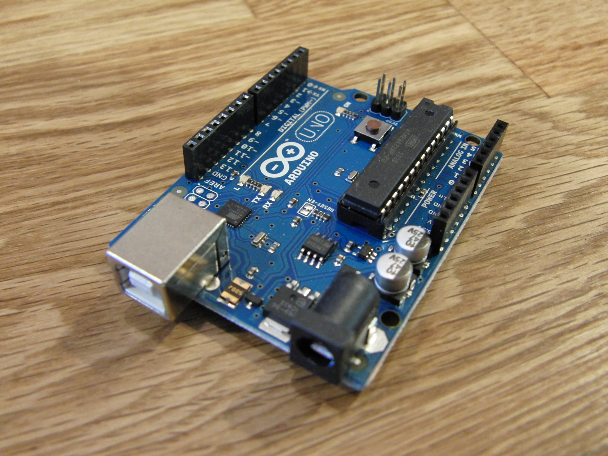
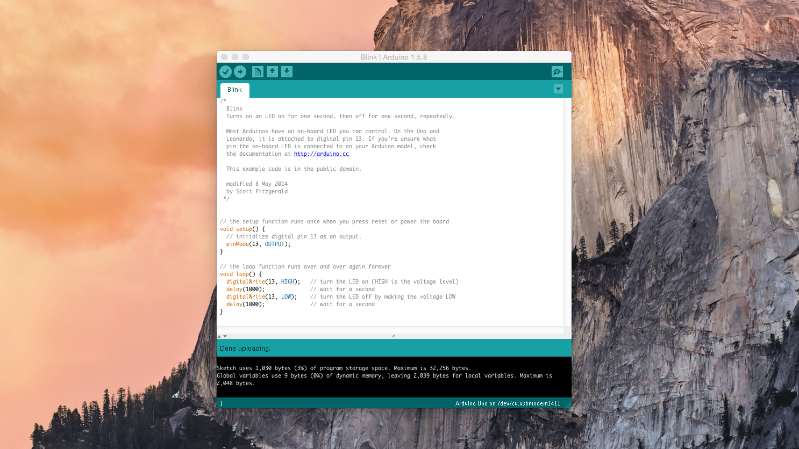

#Introduction to Arduino

###Andrew Madsen
####CocoaHeads SLC - February 3, 2015

---

#What I’ll Cover
<br>

- Microcontroller basics
- Why Arduino?
- Arduino programming
- Talking to Arduino from a Mac app

---



#Microcontroller basics

---


#Microcontroller basics

**- Computer on a single chip.
- Self contained. RAM, ROM, I/O, etc. are included.
- Low power consumption.
- For embedded applications.**

---

#Traditional Microcontrollers

- “Bare Metal”
- Lots of boilerplate code required even just to boot up
- Just a chip. Assembly required.
- In general, you write everything.

^Traditional microcontrollers don’t really hold your hand. You have direct access to all hardware. Until relatively recently, microcontrollers were still programmed in assembly, and assembly is still often used.

^Just to get a microcontroller to boot up, lots of boilerplate is required. Setting clock divisors, configuring power management, setting up peripherals, etc. This is done in hardware by properly configuring hardware pins, along with writing specific
values to certain registers. It’s difficult to troubleshoot when something goes wrong.

^Microcontrollers are just single, bare chips. To actually use one, you have to design a power supply, put it on a board with connectors, wire up peripherals, etc. Of course, development kits make this easier.

^In general, when programminga microcontroller, there are no libraries or frameworks. You write everything yourself. There are exeptions (lwip, etc.), of course.

---



#Why Arduino?

---


#Why Arduino?

- No boilerplate required.
- Get up and running *very* quickly.
- Tons of pre-designed peripherals.
- Lots of easy to use libraries.
- Open source software _and_ hardware.
- _**Huge community**_

---

#Downsides

- The IDE is pretty basic.
- Library functions can perform poorly.
- Limited choice of processors.

^On point number 2, note that you can drop down to AVR C code or assembly when needed.

--- 

#Getting Started

- Lots of different [options](http://arduino.cc/en/Main/Products) for Arduino boards.
- [Arduino Uno](http://arduino.cc/en/Main/ArduinoBoardUno) is the standard.
- Download the free [Arduino IDE](http://arduino.cc/en/Main/Software).
- Arduino shields make it _very_ easy to add peripherals.

---

#Arduino Programming

- Arduino projects are called “**sketches**”
- The Arduino language is simple, and C/C++ like.
- Can also program directly in AVR C, C++, or assembly.
 
---

#Arduino Programming

```c

// the setup routine runs once when you press reset:
void setup() {
    // Setup code goes here
}

// the loop routine runs over and over again forever:
void loop() {
}
```

^Arduino essentially uses a simplified version of C/C++. The two essential parts of an Arduino program are `setup()` and `loop()`. `setup()` is called on startup and can be used to setup peripherals, do initialization, etc. Then, `loop()` is called over and over indefinitely.

---

#Blinky

```c
/*
  Blink
  Turns on an LED on for one second, then off for one second, repeatedly.
 
  This example code is in the public domain.
 */
 
// Pin 13 has an LED connected on most Arduino boards.
// give it a name:
int led = 13;

// the setup routine runs once when you press reset:
void setup() {                
  // initialize the digital pin as an output.
  pinMode(led, OUTPUT);     
}

// the loop routine runs over and over again forever:
void loop() {
  digitalWrite(led, HIGH);   // turn the LED on (HIGH is the voltage level)
  delay(1000);               // wait for a second
  digitalWrite(led, LOW);    // turn the LED off by making the voltage LOW
  delay(1000);               // wait for a second
}
```

---

#Built In Functions<br><br>
##General
**setup()** - Called upon start up.
**loop()** - Called repeatedly forever.
**delay()** - Wait a specified number of milliseconds.

---

#Built In Functions<br><br>
##I/O
**pinMode()** - Configures pin as either an input or an output.
**digitalWrite()** - Sets the state of a digital input pin.
**digitalRead()** - Reads the state of a digital input pin.
**analogWrite()** - Sets the state of a analog input pin.
**analogRead()** - Reads the state of a analog input pin.

---

#Built In Functions<br><br>
##Interrupts
**attachInterrupt()** - Sets up an interrupt function (ISR).
**noInterrupts()** - Disables interrupts.
**interrupts()** - (Re)enables interrupts.

---

#Built In Functions<br>
##Communication
**Serial** - An object representing the serial port.
**Serial.begin()** - Sets baud rate and configuration, opens serial port.
**Serial.write()** - Writes (sends) data to the serial port.
**Serial.readBytes()** - Reads a specified number of bytes from the serial port.
**serialEvent()** - Called when serial data is available. Not available on all boards.

---

#[fit]Arduino IDE



---

#Serial Port

Arduino’s USB port serves two purposes. It is used to download programs into the Arduino. After the program starts, it becomes a standard serial port.

You can use `Serial.write()` like `printf()` or `NSLog()`. Use the IDE’s Serial Monitor window to communicate.

```c

// the setup routine runs once when you press reset:
void setup() {
    Serial.begin(9600);
    Serial.println("Setup complete");
}

// the loop routine runs over and over again forever:
void loop() {
    Serial.println("Looping");
}
```

---

#[fit]Demo Time

---

#Resources

- [https://github.com/armadsen/IntroToArduino](https://github.com/armadsen/IntroToArduino)
- Arduino Homepage: [http://arduino.cc](http://arduino.cc)
- [Dash docset](http://newyork2.kapeli.com/feeds/Arduino.tgz)
- Adafruit, Sparkfun, RadioShack for hardware including shields.

---

#Next Time
<br>
- Arduino <-> Peripheral Communication
- Bluetooth 4.0
- Communication with iOS apps
- Beyond prototyping
